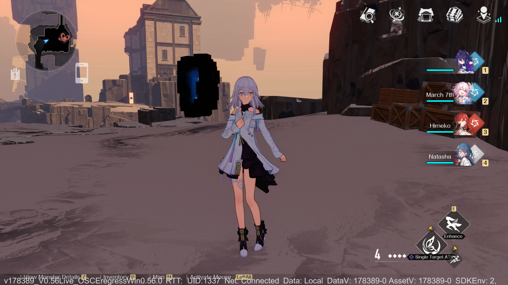

# Eileen-SR
Server Emulator for the Pre-Beta version of Honkai: Star Rail.


# Features
- Exploration
- Cocoon Stages
- Lineups
- Light cones with equip persistence

# Getting Started
## Requirements
- Zig 0.16.0-dev.2905 [Linux](https://ziglang.org/builds/zig-x86_64-linux-0.16.0-dev.2905+5d71e3051.tar.xz)/[Windows](https://ziglang.org/builds/zig-x86_64-windows-0.16.0-dev.2905+5d71e3051.zip)

#### For additional help, you can join our [discord server](https://discord.xeondev.com)

## Setup
### Building from sources
#### Linux
```sh
git clone https://git.xeondev.com/eileen-sr/eileen-sr.git
cd eileen-sr
. ./envrc # In case you don't have zig installed, `envrc` can do this for you.
zig build run-dpsv &
zig build run-gamesv
```
#### Windows
```sh
# Assuming you have git installed and are using powershell.
git clone https://git.xeondev.com/eileen-sr/eileen-sr.git
cd eileen-sr
./setup-env.ps1 # In case you don't have zig installed, `setup-env.ps1` can do this for you.
Start-Process zig -ArgumentList "build run-dpsv -Doptimize=ReleaseSmall" -NoNewWindow; zig build run-gamesv -Doptimize=ReleaseSmall
```

### Logging in
The target client version is 0.56, you can get it from 3rd party sources.
Next, you have to apply the necessary [client patch](https://git.xeondev.com/eileen-sr/locomotive). It enables debug features and applies the necessary game logic patches for the better experience. Follow the instructions from the patch's README.

## Community
- [Our Discord Server](https://discord.xeondev.com)
- [Our Telegram Channel](https://t.me/reversedrooms)

## Donations
Continuing to produce open source software requires contribution of time, code and -especially for the distribution- money. If you are able to make a contribution, it will go towards ensuring that we are able to continue to write, support and host the high quality software that makes all of our lives easier. Feel free to make a contribution [via Boosty](https://boosty.to/xeondev/donate)!
